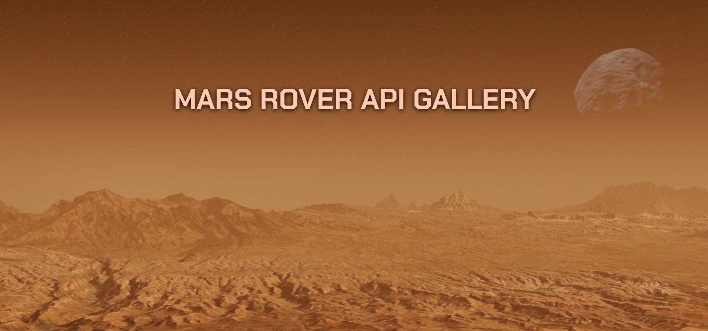

# Mars Rover Api Gallery



Small website that uses NASA api with pictures of three mars rovers. I made it as my first project. The subject was selected according to my personal hobbies.

https://janek92.github.io/Mars-Rover-Api-Gallery/

## Technologies


## How it works

Every single selection of specific rover is fetching information about day of landing and maximum day of expedition and assign it into inputs so the values are always proper to selected rover.

## Usage

To manage the project just clone the repository:

```
git clone https://github.com/Janek92/Mars-Rover-Api-Gallery.git
```

You don't have to install because it is not created as npm project but it uses sass files so you need Live Sass Compiler. So if you want to change styles in VSCode Editor press `ctrl+P` and type

```
ext install glenn2223.live-sass
```

or download it via extension installer.
